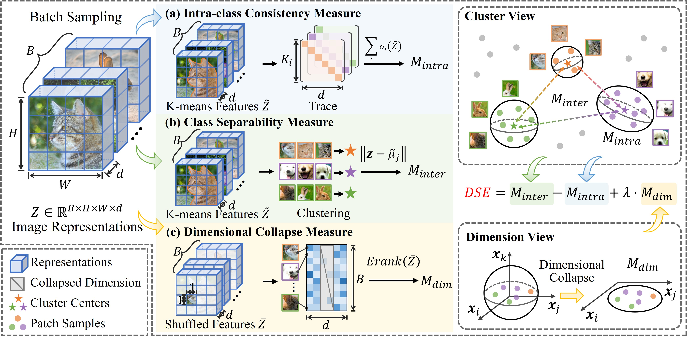
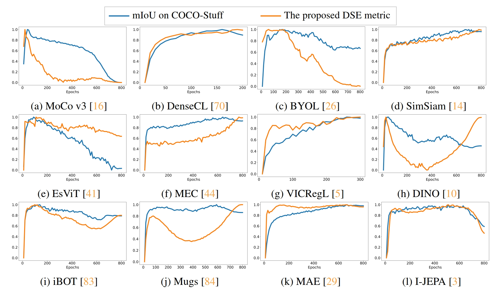

# Estimating Model Performance in Dense Prediction Tasks by Representation Structure

A PyTorch implementation of Dense Representation Structure Estimator (DSE). For details, see our paper: 

[](https://arxiv.org/abs/2503.15096)

**Exploring Structural Degradation in Dense Representations for Self-supervised Learning (NeurIPS 2025)**

**Authors: [Siran Dai](https://eldercatsam.github.io/), [Qianqian Xu*](https://qianqianxu010.github.io/), [Peisong Wen](https://eldercatsam.github.io/), [Yang Liu](https://yafeng19.github.io/), [Qingming Huang*](https://people.ucas.ac.cn/~qmhuang)**   


<div align="center">
  
</div>

## Requirements

Before running the project, ensure the following dependencies are installed:

- Python 3.x
- Required Python libraries (e.g., `torch==1.13`, `torchvision`, `timm`, etc.)


## 🔧 Calculating DSE Metric

1. Prepare Pretrained Models
   
    Before computing the DSE metric, make sure the pretrained models are prepared and placed in the appropriate directory. Confirm that the model paths are correctly referenced in the commands that follow.

    To evaluate custom models, refer to the implementations in `models/__init__.py`.

2. Compute the DSE Metric

    To compute the DSE metric for pretrained models, run the following command (DINO is used here as an example):

    ```bash
    python get_DSE.py \
        --data_root /path/to/your/dataset/ \
        --local_clusters 3 \
        --global_clusters 24 \
        --data_percent 0.001 \
        --normalize \
        --model_type dino \
        --save_root ./results/dino \
        --model_root /path/to/your/dino/checkpoints 
    ```

    After collecting all results, compile them into an Excel file and recalculate the DSE metric using standard deviation normalization ($\lambda$ as defined in the original paper).

<div align="center">
  
</div>

## 💻 Using DSE for Model Selection
To compute the model candidate set, run the following command:

```bash
python model_selection.py 
```

Make sure the result path is correctly set before running the calculation.

## 🚀 Integrating DSE into the Training Process
To incorporate DSE into the training process, add the DSE regularizer defined in `DSE_regularizer.py` to the loss function, or log the DSE metric during training.

## 🖋️ Citation

If you find this repository useful in your research, please consider citing our paper:

```
@misc{dai2025exploringstructuraldegradationdense,
      title={Exploring Structural Degradation in Dense Representations for Self-supervised Learning}, 
      author={Siran Dai and Qianqian Xu and Peisong Wen and Yang Liu and Qingming Huang},
      year={2025},
      eprint={2510.17299},
      archivePrefix={arXiv},
      primaryClass={cs.CV},
      url={https://arxiv.org/abs/2510.17299}, 
}
```
